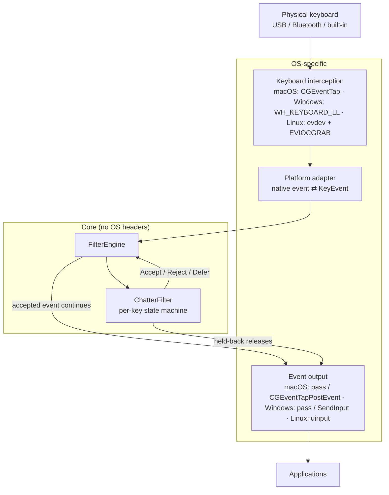
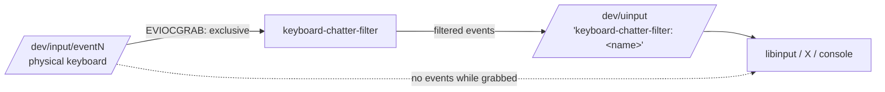

# Architecture

keyboard-chatter-filter is a single small C++20 executable per platform. All filtering decisions
are made by a platform-independent core; each operating system contributes an *adapter* that turns
native keyboard events into the common `KeyEvent` and back.

## Layers

| Layer | Location | Depends on |
|---|---|---|
| Core: `KeyEvent`, `ChatterFilter`, `FilterEngine`, `Configuration` | `include/keyboard_filter/`, `src/core/` | C++ standard library only |
| Adapter translation rules (pure functions, testable anywhere) | `src/macos/event_conversion.*`, `src/windows/key_mapping.*`, `src/linux/device_classifier.*` | core |
| Common application code: logging, CLI parsing, status protocol, POSIX helpers | `src/common/` | core |
| Platform adapters, daemons, service management | `src/macos/`, `src/windows/`, `src/linux/` | everything above + OS APIs |
| Entry point | `src/app/main.cpp` → `src/app/platform.h` | the platform's implementation |

The core never includes an operating-system header; CMake builds it as a separate library and the
tests link only against it.

## Interfaces

All in `include/keyboard_filter/keyboard_io.h`:

* **`IKeyboardInterceptor`** — `start(IKeyEventHandler&)` / `stop()`. Owns the OS interception
  mechanism. Implementations must remove it in `stop()` and their destructor (RAII) so a stopped
  filter can never leave the keyboard captured.
* **`IKeyEventHandler`** — `on_key_event(KeyEvent) → Decision`, `on_events_lost()`,
  `on_key_state(code, down, now)`. Implemented by `FilterEngine`.
* **`IKeyboardOutput`** — `emit(KeyEvent)`: deliver an event the filter releases *later* (a
  held-back key-up), or must insert *before* the event currently being processed.
* **`IWakeupScheduler`** — a one-shot timer on the platform's event loop.
* **`IClock`** — monotonic time in the same domain as event timestamps.

`ChatterFilter::process()` returns a `Decision` for the incoming event:

* `Accept` — let the native event continue unchanged (Linux: forward it to the virtual keyboard);
* `Reject` — drop it (chatter, duplicate, orphaned repeat);
* `Defer` — drop it *for now*; the filter owns it and either emits it later through
  `IKeyboardOutput` (a genuine release) or discards it (the key bounced back down). Only happens in
  deferred release mode (Linux).

`FilterEngine` also implements the **safety circuit breaker** (see
[filter-algorithm.md](filter-algorithm.md#safety-circuit-breaker)): if a key's deliberate presses
keep being dropped, it stops filtering and lets everything through.

Adapters keep a copy of every deferred native event, so what applications finally receive is the
original event (same key code, scan code, flags), not a reconstruction.

## Platform adapters

### macOS (`src/macos/`)

* A per-user **LaunchAgent** runs `keyboard-chatter-filter run` at login, with no root needed.
* A Quartz **event tap** at the HID level (`CGEventTapCreate(kCGHIDEventTap,
  kCGHeadInsertEventTap, kCGEventTapOptionDefault, …)`) sees key down/up events before any
  application. Modifier keys (`flagsChanged`) are not intercepted. Requires the Accessibility
  permission.
* **Immediate release mode**: accepted events are returned from the callback unchanged, rejected
  ones return `NULL`. The adapter never creates or re-posts an event, so it can only remove complete
  press/release pairs.
* Event timestamps are used only when plausible; otherwise the arrival time is used.
* Events not generated by the HID system (`kCGEventSourceStateID`), or posted by any process
  (`kCGEventSourceUnixProcessID`), are software input and pass.
* If macOS disables the tap (timeout or secure input), it is re-enabled and per-key state reset.

### Windows (`src/windows/`)

* A **Windows service** (LocalSystem, automatic start, restart on failure) runs in Session 0, which
  cannot see the interactive desktop's keyboard. It therefore starts one **agent** process per
  interactive session with the user's own token (`WTSQueryUserToken` + `CreateProcessAsUserW`),
  supervises it with exponential back-off, and stops it gracefully through an inherited event.
* The agent installs a **low-level keyboard hook** (`WH_KEYBOARD_LL`) on a thread that pumps
  messages. Rejected events are blocked by returning 1; injected events (`LLKHF_INJECTED`) always
  pass.
* **Immediate release mode** with modifier keys untouched, as on macOS: nothing is ever re-injected
  with `SendInput`. (The output adapter can re-inject in order, should a future driver-based
  adapter make deferred mode safe on Windows.)
* Key identity is the hardware scan code plus the extended-key bit (layout-independent).
* The hook is reinstalled after session unlock and resume from sleep (Windows silently removes
  low-level hooks that once timed out).
* The adapter is replaceable: a future kernel-mode filter driver could implement the same
  `IKeyboardInterceptor`/`IKeyboardOutput` pair without touching the core.

### Linux (`src/linux/`)

* A **systemd system service** (root, but with an empty capability set, no network, read-only
  filesystem, device allow-list) runs from boot.
* Keyboards are discovered by **capabilities** (letter keys + space + enter, or a full keypad; no
  pointer axes or buttons), never by device number. Mice, touchpads, tablets, game controllers,
  power buttons, virtual (software) devices, YubiKeys and configured `ignored_devices` are left
  alone. Hot-plugging is handled with inotify on `/dev/input`.
* Each physical keyboard is **grabbed** (`EVIOCGRAB`) so applications never receive its events
  directly, and mirrored by a **uinput virtual keyboard** with the same keys, LEDs and IDs (bus
  type set to virtual so hardware keymaps are not applied twice). Applications read only the
  filtered stream.
* The grab is taken only when no key on the device is held, so nothing gets stuck.
* If the process dies for any reason, the kernel releases the grab and removes the virtual
  keyboard immediately; input falls back to the physical keyboard. A systemd watchdog kills the
  process if its event loop ever hangs.
* `SYN_DROPPED` (kernel buffer overflow) triggers a resynchronisation from `EVIOCGKEY`.
* No libevdev or libudev dependency: the documented kernel ioctls are used directly, so the release
  binary is fully static (musl) and runs on any distribution.

## Process model and IPC

| | macOS | Windows | Linux |
|---|---|---|---|
| Startup registration | `~/Library/LaunchAgents/keyboard-chatter-filter.plist` | Windows service `keyboard-chatter-filter` | `/etc/systemd/system/keyboard-chatter-filter.service` |
| Runs as | the logged-in user | service: LocalSystem; agent: the session's user | root without capabilities |
| Single instance | `flock` on `~/Library/Application Support/keyboard-chatter-filter/daemon.lock` | named mutex `Local\keyboard-chatter-filter-agent` | `flock` on `/run/keyboard-chatter-filter/daemon.lock` |
| Status | Unix socket next to the lock | SCM state + session mutex | `/run/keyboard-chatter-filter/status.sock` |
| Reload | `SIGHUP` (`launchctl kill`) | `SERVICE_CONTROL_PARAMCHANGE` → agents | `SIGHUP` (`systemctl reload`) |
| Restart on crash | launchd `KeepAlive` | SCM failure actions + agent supervisor | systemd `Restart=on-failure` + watchdog |

The status socket answers each connection with one `key=value` snapshot and closes it. It never
reads from clients, so it cannot be used to block or influence the daemon, and it exposes nothing
about what was typed (counts and settings only).

## Event loops

All loops are event-driven; nothing polls.

* macOS: `CFRunLoop` with the tap's run-loop source, one `CFRunLoopTimer`, and GCD sources for
  signals and the status socket. A 2-second retry timer exists only while waiting for permission.
* Windows agent: `MsgWaitForMultipleObjectsEx` over the stop/reload events and a high-resolution
  waitable timer, pumping messages (which is where the hook runs).
* Linux: one `epoll` over the devices, uinput LED feedback, inotify, `signalfd`, `timerfd`s and
  the status socket.

## Testing strategy

* **Core**: exhaustive unit and randomised property tests through a fake keyboard
  (`tests/fake_keyboard.h`) that simulates the interceptor, output, clock and timer.
* **Adapter translation rules**: unit tests for every platform, run on every CI runner.
* **Linux kernel integration**: `tests/linux_uinput_integration_tests.cpp` creates a synthetic
  chattering keyboard with uinput, runs the real daemon against it, reads the virtual keyboard,
  and verifies that a killed filter hands the keyboard back.
* **macOS and Windows** interception needs a logged-in desktop and (on macOS) a permission grant,
  which hosted CI cannot provide; see the platform documents for manual verification steps.
