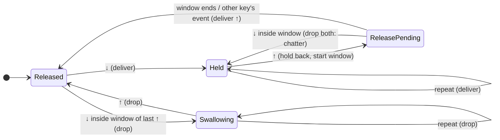

# How the chatter filter works

This document describes the filtering algorithm in `src/core/chatter_filter.cpp`. The code is the
same on every operating system; platform adapters only translate native events to and from the
common `KeyEvent`.

## What chatter looks like to the operating system

A key switch is a mechanical contact. When it closes or opens, the contact can bounce for a few
milliseconds. Keyboard firmware debounces this, but worn, dirty or defective switches (and some
low-travel designs) bounce for longer than the firmware's window, or briefly lose contact while
held. The OS then receives **extra transitions of one key**:

| Situation | What the OS receives | What the user meant |
|---|---|---|
| Normal press | `↓ ……… ↑` | one keystroke |
| Bounce on press | `↓ ↑ ↓ ……… ↑` (gaps of 1–10 ms) | one keystroke |
| Bounce on release | `↓ ……… ↑ ↓ ↑` | one keystroke |
| Contact loss while held | `↓ …… ↑ ↓ …… ↑` (gap of a few ms) | one long press |
| Duplicate report | `↓ ↓ ……… ↑` | one keystroke |

Every one of these contains the same signature: **a key is released and pressed again within a few
milliseconds** (or pressed twice without a release). A human cannot lift a finger and press the same
key again that fast: even very fast same-key double taps ("ll", "ee", game key spamming) have a
release-to-press gap well above 30 ms.

That gap, measured per key, is what the filter uses. It deliberately does **not** use rules like
"drop any repeat of the same key within 30 ms of the last one", which would break:

* **auto-repeat**: held keys produce repeats every 10–35 ms by design;
* **fast double letters**: two presses 60 ms apart have a short press-to-press time but a normal
  release-to-press gap;
* **chords and rollover**: other keys must never influence each other.

## Rules

`threshold` (default 30 ms, configurable, optionally per key) is the *chatter window*.

1. **Presses are delivered immediately.** No latency is ever added to a key-down.
2. **Releases are held back for the window.** When a key goes up, the release is kept for
   `threshold` ms.
   * If the same key goes down again inside the window, the release and the re-press were
     chatter: **both are dropped** and applications keep seeing the key held. This preserves long
     presses, modifier holds and auto-repeat even when the switch bounces mid-hold.
   * Otherwise the release is delivered when the window ends (a one-shot timer, no polling).
3. **Order is preserved.** Before any event of a *different* key is delivered, a held-back release
   is delivered first. Applications therefore see events in exactly the order they happened:
   releasing Shift and typing a letter 5 ms later still produces a lowercase letter, and chords and
   tap-hold remappers downstream see the true sequence. A consequence is that at most one release
   is ever held back at a time.
4. **Fallback for interleaved bounces.** If a held-back release had to be delivered early (because
   another key was pressed) and the key then bounces back down inside the window, the spurious
   press is dropped, and so is its release. One keystroke still comes out.
5. **Duplicate transitions.** A second press of a key that is already down, inside the window of
   its press, is dropped (OS auto-repeat never starts that early: the minimum repeat delay on every
   platform is far above 30 ms). A release of a key that is already up, inside the window, is
   dropped.
6. **Auto-repeat.** Repeat events (flagged by macOS and Linux; on Windows recognised as further
   presses of a held key) pass while the key is held from the applications' point of view, and
   are dropped for a key whose press was removed as chatter.
7. **Unknown state fails open.** A key the filter has never seen (e.g. held while the filter
   started) passes untouched, so nothing gets stuck.

### State per key

The filter keeps a fixed-size table indexed by key code (allocated once), so processing an event is
O(1) and never allocates.

## Timing and clocks

* Timestamps come from the OS event where available (macOS event timestamps, Linux evdev events
  switched to `CLOCK_MONOTONIC`) and from `QueryPerformanceCounter` at hook time on Windows (the
  hook's own `time` field has 10–16 ms resolution).
* The comparison is `release-to-press gap < threshold`. A gap exactly equal to the threshold is
  treated as legitimate.
* Timestamps that step backwards by less than the window are treated as simultaneous; larger
  backward jumps (clock reset) are treated as unrelated, so a clock anomaly can never cause a
  genuine keystroke to be dropped.
* A held-back release whose deadline lies implausibly far in the future (a clock-domain mismatch)
  is delivered at the next timer tick: a release can never get stuck.

## Trade-offs

* **Release latency.** A release reaches applications up to `threshold` ms late, unless another key
  is pressed first (then immediately). Typing is unaffected: characters are produced on key-down.
  Games that react to key-up see up to 30 ms extra delay on the last key released.
* **Threshold choice.** No single value fits every keyboard. 30 ms removes typical chatter while
  leaving a wide margin below human same-key re-press times. Raise it if doubles still get through;
  lower it if intentional fast double-taps get merged. The core supports per-key thresholds for
  future configuration.
* **Machine-typed input** (YubiKey OTPs, barcode scanners) can legitimately repeat a key within a
  few milliseconds. Such input is indistinguishable from chatter by timing alone. Software-generated
  input is never filtered on any platform; on Linux, YubiKeys and configured devices are excluded
  by device. See the README's *Limitations*.

## Tests

`tests/chatter_filter_tests.cpp` covers every rule above (chatter at 0, 5, 10, 20, 29 and 29.999 ms,
the exact boundary, duplicate transitions, held keys, repeats, modifiers, chords, rollover,
interleaved bounces on several keys, clock anomalies, settings changes, resynchronisation) plus
randomised property tests that generate interleaved typing on several keys with random bounce
trains and check that:

* every delivered event is an unmodified input event, delivered in input order;
* per key, applications see strictly alternating press/release, and nothing is left held;
* every intended keystroke arrives exactly once;
* input without chatter passes through completely unchanged;
* no release is delayed by more than the threshold.
