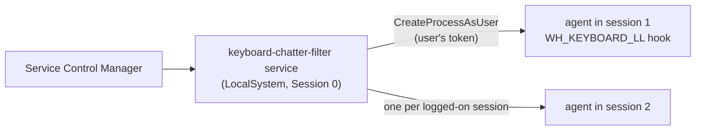

# Windows

Supported: Windows 10 and 11, x64 and ARM64.

## How it runs

* `keyboard-chatter-filter install` (elevated) creates the Windows service
  `keyboard-chatter-filter` with:
  * automatic start at boot;
  * failure actions: restart after 5 s, 5 s, then 30 s (reset daily), also when the service stops
    with an error code;
  * a description stating that keystrokes are processed in memory only.
* A service runs in **Session 0**, which has no access to the interactive desktop; a low-level
  keyboard hook installed there would never see the user's typing. The service therefore launches
  one **agent** in every interactive session (at service start and on logon, unlock and console or
  remote connect notifications) using that session's user token, so the agent runs with the
  user's normal (non-elevated) rights. It restarts agents that crash, with back-off from 1 s up to
  60 s, and stops them gracefully through an inherited event so any held-back key-up is delivered
  first.
* Files:
  * binary: `%ProgramFiles%\keyboard-chatter-filter\keyboard-chatter-filter.exe` (the service refuses
    to register a binary anywhere else: it runs as LocalSystem, so its executable must not be
    writable by ordinary users);
  * configuration: `%ProgramData%\keyboard-chatter-filter\config.toml` (machine-wide; the folder is
    created with an explicit ACL: SYSTEM and Administrators full control, Users read-only);
  * service log: `%ProgramData%\keyboard-chatter-filter\logs\service.log`;
  * agent log: `%LOCALAPPDATA%\keyboard-chatter-filter\agent.log` (per user).
  Logs rotate at 1 MiB and never contain keystrokes.

## Permissions

* Installing, uninstalling, starting, stopping and reloading the service need an elevated terminal.
* No special privilege is needed to filter: low-level keyboard hooks are available to normal
  desktop processes. The agent runs as the logged-in user.

## Event handling details

* Interception uses `SetWindowsHookExW(WH_KEYBOARD_LL)` on a thread that pumps messages, as the hook
  requires. The hook procedure does constant work and returns immediately.
* Key identity is the hardware **scan code** plus the extended-key flag (`LLKHF_EXTENDED`), so it is
  independent of the keyboard layout and distinguishes left/right modifiers.
* Events flagged `LLKHF_INJECTED` (software input, including our own re-injections) always pass.
  Driver-generated companions such as the AltGr "fake Control" and NumLock "fake Shift" sequences
  pass untouched.
* Windows does not mark auto-repeat in low-level hooks; repeats are recognised by the filter as
  further presses of a key that is already down.
* Timestamps come from `QueryPerformanceCounter` at hook time (the hook's own `time` field has
  10–16 ms resolution, too coarse for a 30 ms window).
* Held-back releases are re-injected with `SendInput` from the message loop, never inside the hook
  procedure. If a held-back **modifier** release must reach applications before the current event
  (Shift released just before the next letter), the current event is blocked and both are injected
  in order.
* Caps Lock, Num Lock and Scroll Lock are filtered like any other key: Windows toggles the lock state
  only when the key-down is delivered, so dropping a chatter press also prevents a double toggle.
* Low-level hooks that ever exceed the system's hook timeout are silently removed by Windows. The
  agent reinstalls its hook after the session is unlocked and after resume from sleep.

## Limitations

* **Elevated windows.** Windows' User Interface Privilege Isolation prevents a normal-integrity hook
  from intercepting input destined for elevated (administrator) windows and the UAC/secure desktop.
  Keystrokes there are not filtered (they are not blocked either).
* **Injected events.** Some events are re-delivered with `SendInput`, which marks them as injected.
  Software that deliberately ignores injected input (some anti-cheat systems) may miss those
  events. Releases of ordinary keys are delayed by at most the threshold; only events directly
  following a modifier release are re-injected.
* **Hook ordering.** If other software also installs low-level keyboard hooks (remappers such as
  AutoHotkey or kanata), the most recently installed hook runs first. Chatter-filtered input should
  reach remappers, so start the filter before them, or use the remapper's own debounce.
* A **kernel-mode filter driver** would remove the first two limitations. The adapter boundary
  (`IKeyboardInterceptor`/`IKeyboardOutput`) is designed so a driver-based adapter can replace the
  hook without touching the filter. It is not implemented: a production driver requires Microsoft
  attestation signing.

## Manual verification checklist

1. In an elevated PowerShell: `irm https://raw.githubusercontent.com/<owner>/<repo>/main/install.ps1 | iex`.
2. `keyboard-chatter-filter status` → service `running`, *Filtering this session: yes*.
3. Type normally in Notepad (fast double letters, Shift-capitalised words, AltGr characters on an
   international layout), hold keys to auto-repeat.
4. Lock and unlock (Win+L), sleep and resume: filtering continues (`agent.log` shows the hook being
   reinstalled).
5. Reboot: the service starts automatically and the agent appears after logon.
6. `keyboard-chatter-filter uninstall` (elevated), or `uninstall.ps1`.
